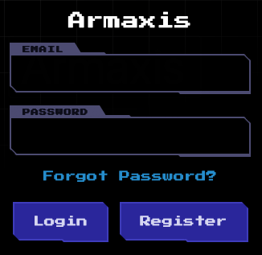

This challenge exposes two ports. The first one hosts the main application:

The second port runs an "email client" service:

.png)

Initially, I assumed I needed to create an account using this email service, but that's not necessary. The email client is used to receive tokens when requesting password resets:

.png)

This behavior seemed suspicious, so I examined the source code. The `getPasswordReset` function has several critical vulnerabilities: it doesn't validate if a token exists or has expired, and it doesn't verify if the token belongs to a specific user:

.png)

This means I can reset the admin's password instead of my own. The admin's email address can also be found in the source code:

.png)

After logging in as admin, the `Dispatch Weapon` feature becomes available. This is a form that accepts markdown input:

.png)

Reviewing the code reveals a dangerous vulnerability. When using markdown image syntax (``), the application uses a regular expression to extract the URL (1), then executes `curl -s ${URL}` (2) to fetch the image contents:

.png)

The application then base64 encodes the command result to embed the image using a data URI scheme.

Since we control the URL parameter, we can inject commands. To read the flag, I used the payload ``, which successfully retrieved the flag:

.png)