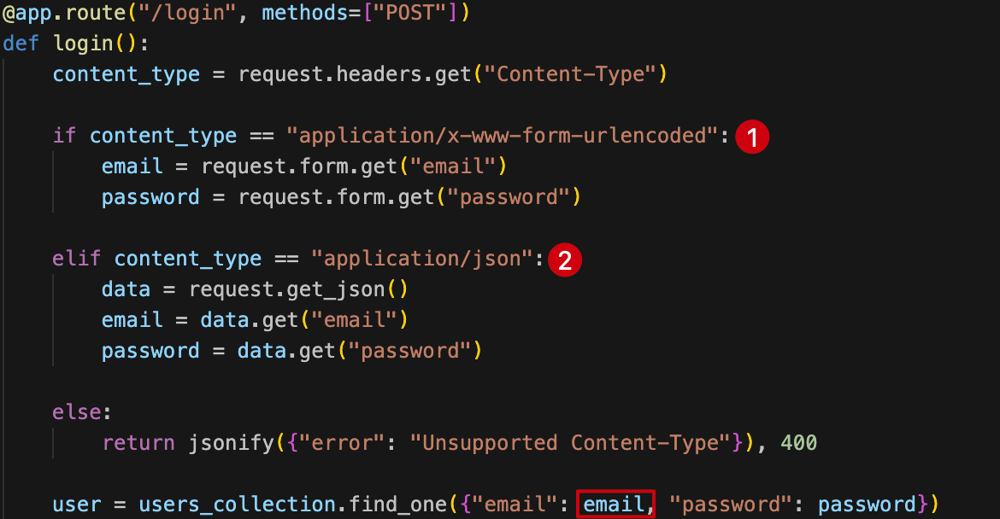

This application implements a simple login functionality using MongoDB as its database.

The `/login` route accepts data in two different formats depending on the `Content-Type` header:



Whether the request uses `application/x-www-form-urlencoded` or `application/json`, the application extracts the email and password parameters and executes a MongoDB query to find a matching user. If successful, it displays the flag; otherwise, it redirects to the main page.

The vulnerability lies in the lack of input validation. Since MongoDB supports conditional operators in queries, we can exploit this by using the `$ne` (not equal) operator to create a query where both email and password are not equal to a specific value, effectively bypassing authentication and retrieving the first user from the database.

To exploit this vulnerability:

1. Attempt to log in with any credentials
2. Intercept the request and modify the `Content-Type` header to `application/json`
3. Replace the request body with the following NoSQL injection payload:

```json
{"email":{"$ne":null},"password":{"$ne":null}}
```

This payload ensures that both the email and password fields are not equal to `null`, which will match any user record in the database and grant access to the flag.

.png)