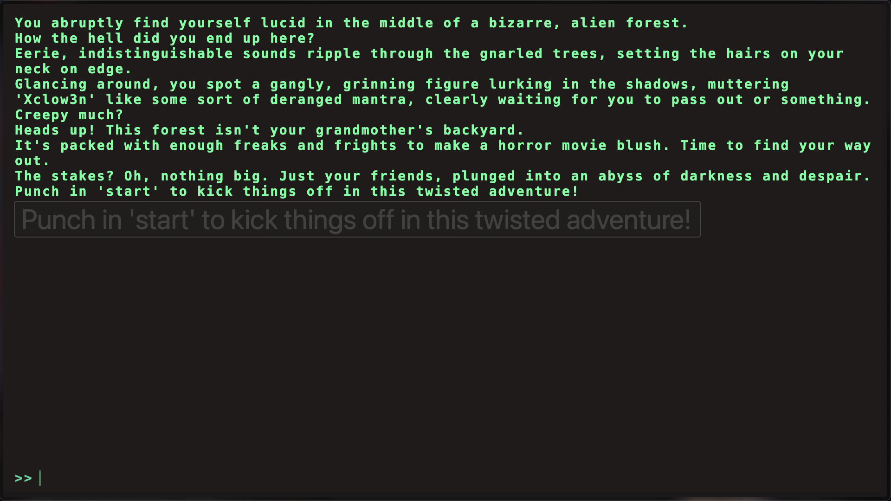

This challenge doesn't provide source code, so we need to analyze the application through dynamic testing.

Upon accessing the challenge, we are presented with a command interface:

After typing "start", the application displays several available command options:

.png)

By intercepting the requests through Burp Suite, we can observe the commands being loaded. Interestingly, we discover a hidden command that isn't displayed in the interface:

.png)

When we execute this hidden command in the console, we successfully retrieve the flag:

.png)
