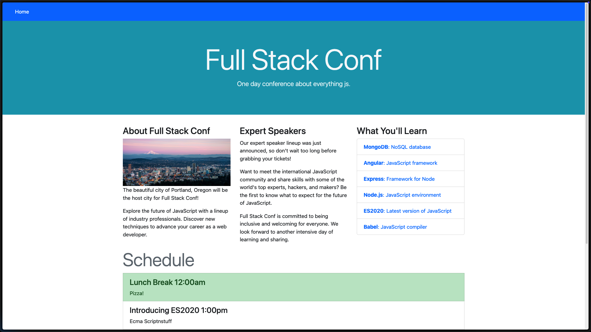

The challenge provides the following description:

```plaintext
Welcome to Full Stack Conf, explore the future of JavaScript with a lineup of industry professionals and discover new techniques to advance your career as a web developer. But be very careful with the stay up to date form, we don't sanitize anything and the admin logs in and checks the emails regularly, don't try anything funny!! 😅
```

This immediately suggests the possibility of a blind XSS attack to steal the admin's cookie and hijack their session. Let's investigate further.

Upon visiting the provided URL, we are greeted with the following page:



At the bottom of the page, we find the following message:

.png)

The page explicitly states: "Stay up-to-date on Full Stack Conf or pop an alert() to get the flag 😅." This suggests that triggering an alert might directly lead to obtaining the flag. To test this, I submitted the following payload:

```html
<script>alert("XSS")</script>
```

After submitting the payload, I successfully obtained the flag:

.png)