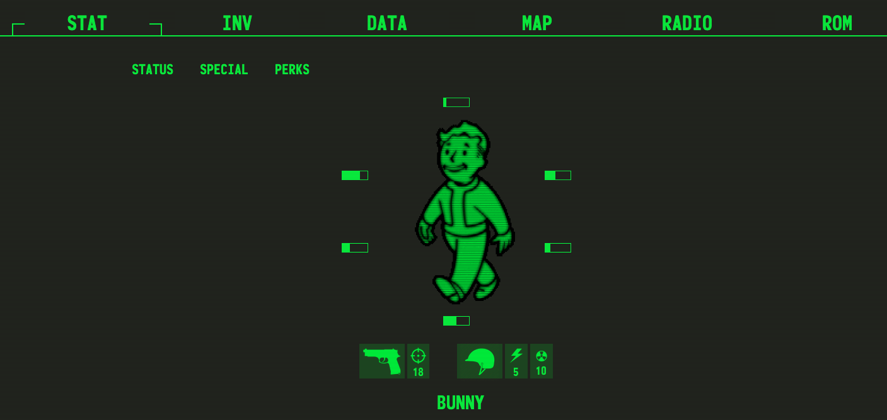

This challenge doesn't provide source code, so we need to analyze the application to find vulnerabilities.

Upon accessing the challenge, we are presented with a web application:

The main interactive feature is the "ROM" section, where we can submit XML data:

.png)

After clicking "Submit", the application reflects the version number from our XML input:

.png)

This behavior suggests the application might be vulnerable to XML External Entity (XXE) injection. We test this by crafting a payload to read local files.

In the exploit, we inject the XXE payload `<!DOCTYPE foo [ <!ENTITY xxe SYSTEM "file:///flag.txt"> ]>` in the DOCTYPE declaration (marked as 1 in the image), and then replace the version number with the entity reference `&xxe;` (marked as 2) to trigger the file read and display the flag content:

.png)

By exploiting the XXE vulnerability, we successfully retrieve the flag.