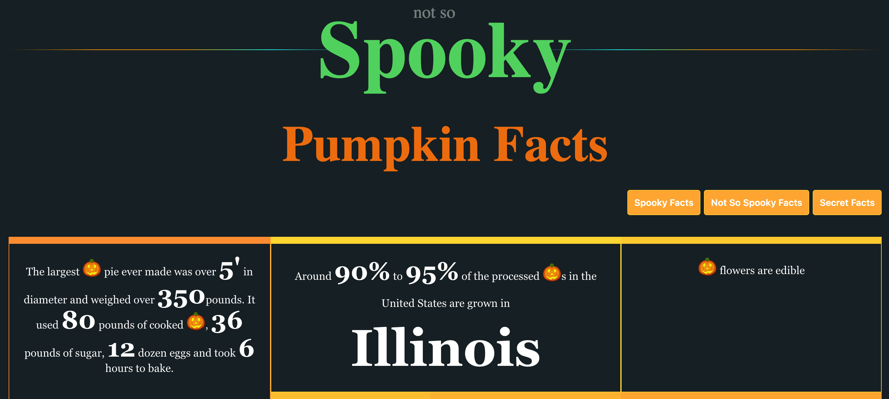

This challenge presents a web application that displays various facts through three available options:
- Spooky facts
- Not So Spooky Facts  
- Secret Facts

The application loads facts by making a POST request to `/api/getfacts` with a JSON body:

.png)

Setting "type" to "secrets" returns the response: "Currently this type can be only accessed through localhost!"

Examining the source code reveals the validation logic:

.png)

There's a validation that prevents accessing secrets unless the request originates from localhost(1). However, the application also uses a switch/case statement to handle different type values(2). As suggested by the challenge title, the vulnerability involves Type Juggling, which occurs because the `switch` statement performs loose comparison.

.png)

To obtain the secrets without directly setting "type" to "secrets", we can exploit PHP's type juggling behavior using this comparison table:

When comparing a string with `true`, the comparison evaluates to true. This allows us to fall into the first case (the "secrets" case), successfully retrieving the flag:

.png)