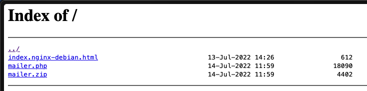

This challenge provides the source code for analysis. The description states: "further enumeration revealed an open directory index containing a PHP mailer script we think was used to send the email. We need access to the server to read the logs and find out the actual perpetrator."

Upon accessing the challenge, we are presented with a directory listing that includes a `mailer.php` script:



After downloading and decompressing the `.zip` file, we can examine the PHP source code. At first glance, the `IMAGE_TYPES` constant might suggest a file upload vulnerability:

```php
const IMAGE_TYPES = ['gif' => 'image/gif', 'jpg' => 'image/jpeg', 'jpeg' => 'image/jpeg', 'jpe' => 'image/jpeg', 'bmp' => 'image/bmp', 'png' => 'image/png', 'tif' => 'image/tiff', 'tiff' => 'image/tiff', 'swf' => 'application/x-shockwave-flash', ];
```

However, the actual vulnerability lies in the improper use of PHP's [`mail()`](https://www.php.net/manual/en/function.mail.php) function. According to the documentation, this function accepts five parameters, with the last two being optional:

.png)

A review of the code reveals that all five parameters are in use:

.png)

The critical issue is that the fifth parameter, `additional_parameters`, is used to pass extra flags as command-line options to the `sendmail` program:

.png)

Analyzing the `send_email` function shows that it captures the `from_email` parameter from the POST request and passes it to the `send` function:

.png)

The vulnerable `send()` function then uses our controlled `from_email` parameter as the fifth argument for the `mail()` function:

.png)

Although PHP's `escapeshellcmd()` function prevents direct command injection, we can still inject additional parameters. By consulting the `sendmail` manual, we find the `-X` flag, which allows us to specify a log file.

This flag logs detailed information to the specified file, enabling us to create a log file with a `.php` extension and inject malicious PHP code into it:

.png)

In the image above, marker 1 points to the injection of `-X test.php` after the email address, which creates a log file named `test.php`. Marker 2 indicates the PHP payload `<?php system($_GET['cmd']); ?>` being injected into the email list field.

After submitting the request, we receive a success confirmation:

.png)

The malicious PHP file is now created and visible in the directory listing:

.png)

We can now execute commands by adding a `cmd` parameter to the URL. A simple command confirms that we have achieved code execution:

.png)

Finally, we can read the flag by leveraging our command execution capability:

.png)
