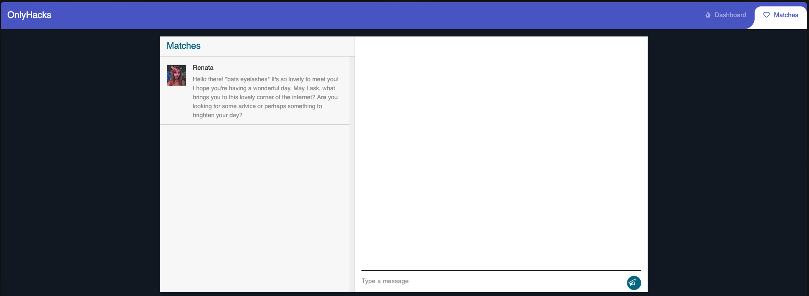

This challenge doesn't provide the source code, which I find more enjoyable.

Initially, the application only allows users to log in or sign up. After logging in, we can "like" other users, similar to a dating app.

In our matches, we find Renata, with whom we can start a chat. The chat functionality is vulnerable to Cross-Site Scripting (XSS) because it lacks proper input sanitization.

I used the payload `` to steal Renata's cookie. I used [webhook.site](http://webhook.site) to receive the request containing the cookie.

.png)

Once I obtained Renata's cookie, I replaced my session cookie with hers. This allowed me to impersonate her, and I found the flag in her chat with Dimitris.

.png)
