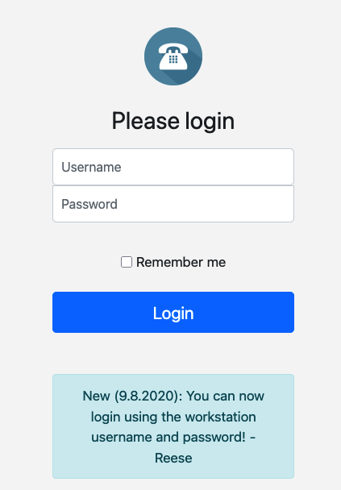

This challenge presents a login form with a message indicating that we can now log in using the workstation username and password, provided by Reese.



Initial testing with various payloads reveals that using the `)` character in the username field (for example `admin)`) results in a 500 Internal Server Error, suggesting potential injection vulnerabilities.

After extensive testing, using `*` as both username and password successfully authenticates us:

.png)

This behavior indicates the application is vulnerable to LDAP injection. The `*` wildcard character is commonly used in LDAP queries and can bypass authentication when improperly handled.

Upon successful login, we discover a search feature that also exhibits similar behavior when the `)` character is used, returning a 500 Internal Server Error:

.png)

However, the search functionality alone doesn't provide access to the flag.

By testing with the username "reese" and a password starting with "HTB*", we confirm successful authentication, suggesting the flag begins with "HTB". To automate the extraction of the complete flag, a Python script [`solution.py`](./solution.py) was developed.

The script uses a character-by-character brute force approach:

```python
with requests.Session() as session:
    while "}" not in password:
        for char in dictionary:
            r = session.post(URL, data={"username": user, "password": password + char + "*"}, allow_redirects=False)
            sys.stdout.write(f"\rFlag: {password + char}{' ' * 20}")
            sys.stdout.flush()
            
            if  "/login" not in r.headers.get("Location", ""):
                password += char
                break
```

The script systematically tests each character in the dictionary, appending a wildcard `*` to allow partial matches in the LDAP query. When the server's redirect behavior indicates a successful partial match, the character is added to the known password.

Running the automated script successfully extracts the complete flag:

.png)