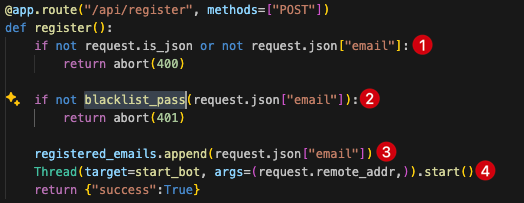

The application has three main routes:
- `/` - Main page
- `/register` - Registration endpoint
- `/bot` - Bot endpoint

In the `/register` route, the application receives an email through a POST request (1), then calls the `blacklist_pass` function with the email as parameter (2). If the email passes validation, it's appended to the `registered_emails` list (3), and finally a new thread is started to run the `start_bot` function (4).

The `blacklist_pass` function validates if the email contains the word "script" and returns false if it does, blocking the registration.

The bot makes a request to the `/bot` endpoint (1), waits three seconds or until an `alert()` is triggered (2). If an alert is detected, it calls the `send_flag` function(3) and finally clears the `registered_emails` list(4).

.png)

The `send_flag` function sends the flag to us when triggered.

The vulnerability exists because the template that displays the emails uses the `safe` filter, which doesn't escape HTML. This means everything is rendered directly in the browser without sanitization.

.png)

Since we need to trigger an `alert()` but can't use the word "script", we can bypass this restriction by using HTML event handlers like `onload` or other XSS vectors that don't contain the blacklisted word.

i solved it using this payload ``

.png)
