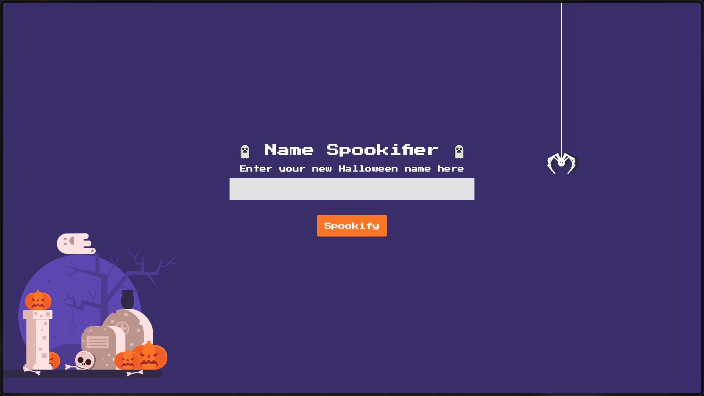

This challenge provides source code, but since it's categorized as "Very Easy," the initial approach was to explore the application dynamically before examining the code.

Upon accessing the challenge, we are presented with a Halloween-themed interface where users can input their "Halloween name":



The application takes user input and renders it using different spooky fonts. For example, inputting "test" produces the following output:

.png)

Initial testing with an XSS payload `` reveals that the application is vulnerable to reflected XSS:

.png)

The lack of input sanitization that allowed XSS suggests the application might also be vulnerable to Server-Side Template Injection. Testing with the payload `${7*7}` confirms SSTI vulnerability:

.png)

Notice that in the image above, marker 1 shows our input payload `${7*7}`, while marker 2 shows the evaluated result `49`, confirming that the server is executing the mathematical expression rather than displaying it as literal text.

Examining the source code reveals why only certain expressions are visible. The application maps characters individually, and only the last font includes mappings for numeric characters:

.png)

Further analysis of the source code confirms that the application uses **Mako** as its templating engine:

.png)

With knowledge of the Mako templating engine, we can craft payloads to read sensitive files. Several effective payloads for reading the flag include:

**Simple file read:**
```python
${open('/flag.txt').read()}
```

**Command execution approaches:**
```python
${__import__('os').popen('cat /flag.txt').read()}
```
```python
${__import__('subprocess').check_output(['cat', '/flag.txt']).decode()}
```
```python
${self.module.cache.util.os.popen('cat /flag.txt').read()}
```

Executing any of these payloads successfully retrieves the flag:

.png)

## References

- [Server-Side Template Injection Payloads](https://github.com/swisskyrepo/PayloadsAllTheThings/tree/master/Server%20Side%20Template%20Injection)