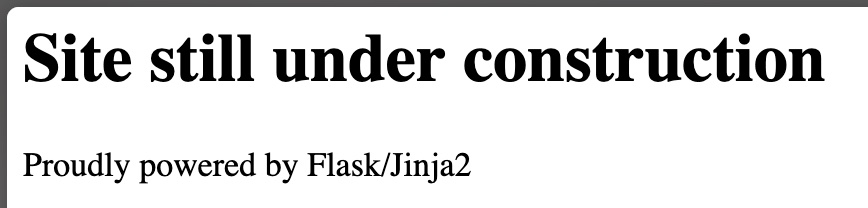

This challenge doesn't provide source code, so we need to analyze the application through dynamic testing.

Upon accessing the challenge, we are presented with a page that indicates the site is under construction:

While there is no apparent functionality, when we try to access a non-existent path (for example `/test`), we notice that the value is reflected in the response. Given the name of the challenge, this suggests a Server-Side Template Injection (SSTI) vulnerability:

.png)

By testing various template injection payloads, we can identify that the application is using Flask as the templating engine:

.png)

Using the payload `{{ config.__class__.from_envvar.__globals__.import_string("os").popen("cat flag.txt").read() }}`, we can read the flag file directly from the server:

.jpeg)
