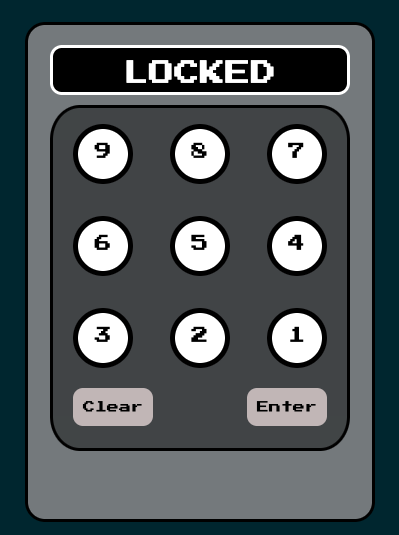

In this challenge, we are presented with a web page that has a lock requiring a PIN to be unlocked:

Upon inspecting the page's source code, the correct PIN is revealed within the code:

.png)

By entering the discovered PIN into the input field, we successfully unlock the lock and retrieve the flag:

.png)