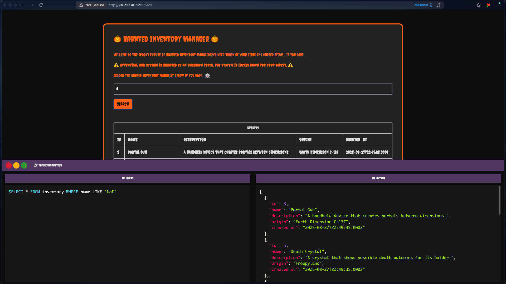

This is a basic site designed to demonstrate SQL injection fundamentals. It features a form where we can search for "haunted items", displaying both the executed query and its output:

This sends a GET request to `/search`:

.png)

This request executes the SQL query and returns the output. Examining the query closely reveals that our input is placed between `'%%'`, allowing us to insert `%'` to close the string and comment out the rest of the query using: `%' -- -`

This gives us control over the query, enabling data extraction beyond what should be accessible through a Union-based SQL injection attack. The query output shows 5 columns, so we can test an injection like: `%'+union+select+1,2,3,4,5+--+-`

.png)

Our values are reflected in the response, confirming the injection works. Now we can extract database names:
`%'+union+select+schema_name,2,3,4,5+from+information_schema.schemata--+-`

.png)

Three databases are present, but `halloween_invetory` appears to be the relevant one. Let's retrieve its tables: `%'+union+select+table_name,2,3,4,5+from+information_schema.tables+where+table_schema='halloween_invetory'--+-`

.png)

The `flag` table is visible. Now let's examine its columns: `%'+union+select+column_name,2,3,4,5+from+information_schema.columns+where+table_schema='halloween_invetory'+and+table_name='flag'--+-`

.png)

The column is named `flag`. With this information, we can extract the flag: `%'+union+select+flag,2,3,4,5+from+flag--+-`

.png)