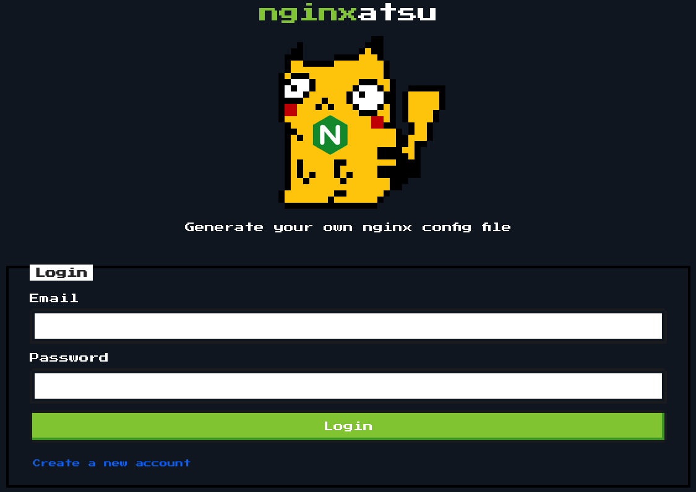

Upon visiting the provided URL, we are greeted with the following interface:



After registering a new account and logging in, we see a page where we can generate our own Nginx configuration file:

.png)

Leaving the default settings and clicking on "Generate Config" creates an item in the "configs" section with the number `51`:

.png)

Clicking on this item takes us to the route `/config/51`, where we can view our configuration file:

.png)

By clicking on "Raw Config" (marked with the number 1 in the image), we can access the raw configuration file:

.png)

The file is located in the `/storage` directory. This catches our attention as the `.conf` file contains the following comment:

```conf
# We sure hope so that we don't spill any secrets
# within the open directory on /storage
```

If we remove the filename from the URL, we discover that the `/storage` directory has directory listing enabled:

.png)

Among the `.conf` files, there is a file named `v1_db_backup_1604123342.tar.gz` that stands out. After downloading and extracting this file, we find a `database.sqlite` file:

.png)

We can inspect the `database.sqlite` file using the `sqlite3` command-line tool:

```bash
sqlite3 database.sqlite
```

Using the `.tables` command, we can list the tables in the database:

```bash
sqlite> .tables
failed_jobs      nginx_configs    users          
migrations       password_resets
```

Among the five tables, the `users` table is the most interesting. Running the following query reveals its contents:

```bash
sqlite> SELECT * FROM users;
1|jr|nginxatsu-adm-01@makelarid.es|e7816e9a10590b1e33b87ec2fa65e6cd|oYUFfxwULd4SR7wX9mZ22Ym22Oq5MozwKY4IuZrK3P1lQLfgGQ5mK2eXxXhd1ONJ7L3v||2025-08-18 03:54:05|2025-08-18 03:54:05
2|Giovann1|nginxatsu-giv@makelarid.es|ea03db44968b5466b0cb99cb778abc29|SqedS7srMdsRDdvyvtPJfBvG8Kj2gZRANoYRfgyiVglVkdHEa1hZla8biUKbw6wxosMf||2025-08-18 03:54:05|2025-08-18 03:54:05
3|me0wth|nginxatsu-me0wth@makelarid.es|a289e25d50a2610a0e91142f32f32b3a|85q5ZbuNddFING8tzoW13QhLJ4IAwU1EpcJ13xlnForVmrbziVrnOMAyJnH25FwaXDMb||2025-08-18 03:54:05|2025-08-18 03:54:05
```

The `users` table contains usernames, emails, password hashes, and other data. Using an online tool like [CrackStation](https://crackstation.net/), we can crack the password hashes:

.png)

The password for the admin account is revealed to be `adminadmin1`. Logging in as the admin gives us access to the flag:

.png)
