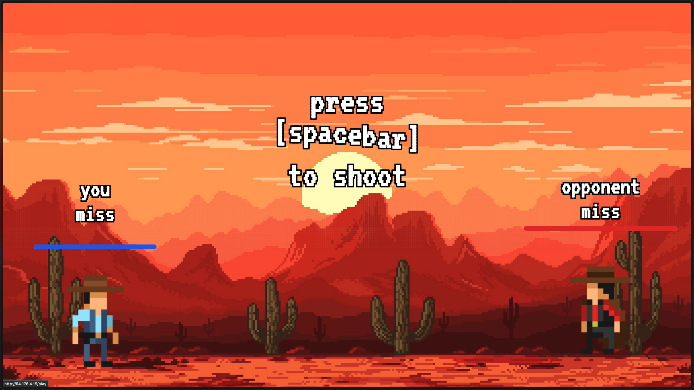

This challenge presents a cowboy duel game where the objective is to defeat the opponent in a gunfight. The game appears to be controlled by pressing the spacebar to shoot.

Upon accessing the challenge, we're presented with a cowboy duel interface. The game mechanics seem straightforward - press spacebar to shoot:

However, attempting to win by simply pressing spacebar proves ineffective against our opponent, suggesting we need an alternative approach.

To understand the game's mechanics, we need to examine the underlying JavaScript code. We can set up a debugger with a keydown event listener to intercept the execution flow:

.png)

This setup allows us to pause execution after pressing spacebar and analyze the code that handles the shooting mechanism.

After stepping through the code execution, we can observe that a function called `Gs()` is being executed when we shoot:

.png)

This function appears to handle the shooting logic. By identifying this function, we can manipulate the game by calling it multiple times.

Instead of relying on manual spacebar presses, we can call the `Gs()` function multiple times programmatically through the browser's console. This effectively allows us to fire multiple shots rapidly, overwhelming our opponent:

.png)

By executing multiple shots through the `Gs()` function, we successfully defeat our opponent and retrieve the flag:

.png)

**Note:** This challenge was solved during ICC preparation. Original source unknown.
